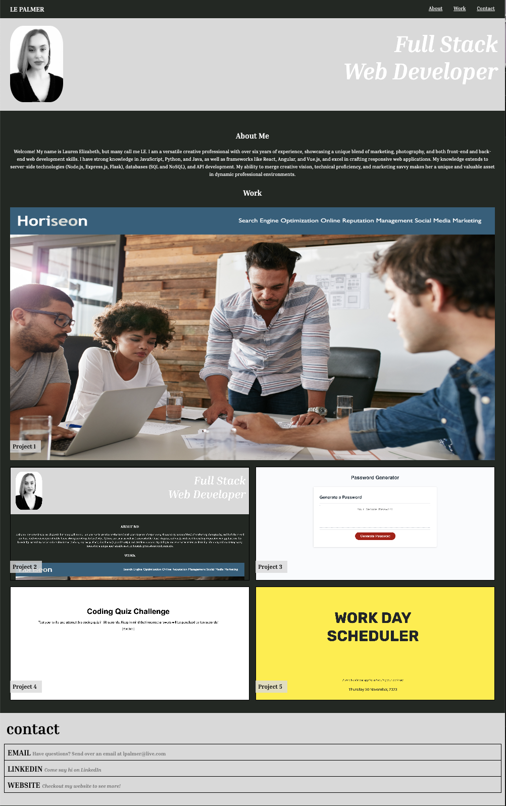

# LE Palmer Portfolio

This project is a simple portfolio to showcase my projects, skills, and learn a bit more about me.  The application uses HTML and CSS.

## Portfolio Functionality
This portfolio is crafted to highlight my proficiency in web development and incorporates the following components:

1.	Developer Information: Uncover details about me through my name and a recent photo or avatar prominently displayed on the homepage.
2.	Intuitive Navigation: Seamlessly explore sections dedicated to information about me, my projects, and how to get in touch using the easily accessible menu.
3.	Effortless Scrolling: Experience a fluid transition between sections by clicking on navigation links, ensuring a user-friendly and smooth browsing encounter.
4.	Project Showcase: Delve into my web development projects, where the first project image takes center stage, capturing attention effectively.
5.	Direct Project Access: Simply click on project images to directly access the deployed applications, streamlining the user's interaction with showcased work.
6.	Adaptive Design: The portfolio gracefully adjusts to diverse screen sizes and devices, guaranteeing an optimal and visually pleasing viewing experience.

## Deployment Application 

The application is deployed and can be accessed online. Check it out here: 

https://lepalmer01.github.io/laurenelizabethPortfolio/

## Credits
Thank you for the tips and suggestionsm from Bootcamp instructors, learning assistants, classmates, and resources. Thank you to my tutors Jaba for assisting me refining my code. I have used http: //www.w3schools.com/ and http://www.stackoverflow.com, and https://chat.openai.com to research information. Lastly,thanks to OpenAI's Chatgpt-4 for assistance in creating this README.md template. 